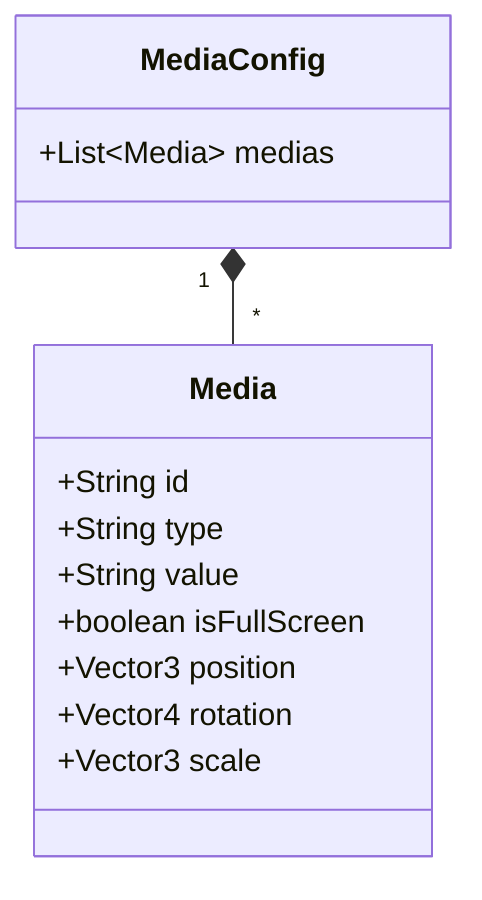
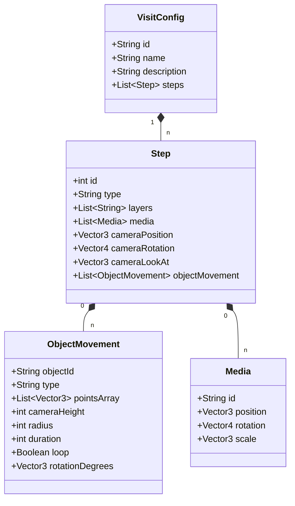

# UD-AGAPE-Demo-FTV_UseCase

This part of the project is a 3D guided visit demo using `ud-viz`, `itowns` and `three.js`. It allows users to navigate through a city with 3DTiles for buildings and multimedia documents (videos, images, etc.) at various coordinates and rotations.
This demo demonstrates as small demos how the scene and entities within it can be affected, be it by position, movement, rotation, being full screen... Each "function" has its own small demo and can be visualised on the first page of the project.
The second page of the project allows user to create their own demo, by creating the json configuration files through a form by first creating the media configuration file, then the visit configuration file.

## Getting Started

### Prerequisites

- Node.js installed on your machine.
- `npm` (Node Package Manager).

### Installation

1.  Clone the repository or download the source code.
2.  Navigate to the project directory in your terminal.
3.  Install dependencies:

```bash
npm install
```

### Running the Demo

To start the application in debug mode (recommended for development and testing):

```bash
npm run start-debug
```

This command builds the project in development mode and starts the backend server. Open your browser at the address indicated in the terminal (usually `http://localhost:8080` or similar, check the `backEnd.js` output).

To build and run for production:

```bash
npm run start
```
or 
``` bash
npm run start-debug
```
if you want to do change to files other than the JavaScript and not have to restart the demo

## Project Structure

-   `src/`: Contains the source code of the application (JavaScript logic).
    -   `guidedVisit.js`: Main logic for the guided tour validation and execution.
-   `assets/`: Static assets.
    -   `config/`: Configuration files (JSON) for the 'compositions' demo content, and also the layer and media configuration files.
        - `functionsConfigFolder`: Configuration files (JSON) for the 'compositions' demo content
    -   `media/`: Documents used in the demo, in their respective folders (videos, images, obj3d...).
    -   `icons`: Icons used in the demos
    -   `logos`: Logos used in the demos, usually of entities that have contributed to the project
-   `html/`: HTML entry points (`hub_demos.html` and `config_editor.html` as of now).
-   `bin/`: Backend server scripts.
- Other files: `package.json`, `webpack.config.js`, etc. for project configuration and dependencies.
- Other `.md` files: Documentation and UML diagrams for the project.

## Configuration Files

The content and behavior of the demo are driven by JSON configuration files located in `assets/config/`.

### 1. `layerConfig.json`

Defines the geospatial layers, initial view extent, and projection details.

**Fields:**
-   `projection`, `transform`: Coordinate system configurations, particularly important for determining the coordinates that will be used for the positions of the camera in `visitConfig.json` and for the position of medias in `mediaConfig.json`.
- `extents`: Defines the initial view extent of the scene, expressed in the `projection` coordinates.
-   `3DTilesLayers`: 3D tilesets (e.g., building models).
-   `elevation_layer`: Elevation layer configuration.
-   `background_image_layer`: Background image layer configuration.

### 2. `mediaConfig.json`

This file defines the multimedia resources (videos, images, other objects... ) used in the visit.

**UML Diagram:**



**Media Object Fields:**
-   `id`: Unique identifier for the media type (to reference in `visitConfig.json` for it to show up).
-   `type`: Type of media (`video`, `image`, `text`, `audio`, `file`, `obj3d`).
-   `value`: Path to the media file (e.g., `../assets/media/videos/Video_P2.mp4`).
-   `isFullScreen` (Optional): Boolean indicating if the media should be displayed in full screen mode.
-   `position` (Optional): Default `{x, y, z}` coordinates to place the media in the 3D scene.
-   `rotation` (Optional): Default `{x, y, z, w}` quaternion for the object's orientation in the scene.
-   `scale` (Optional): Default `{x, y, z}` scale factors forn the object.

### 3. `visitConfig.json`

This file defines the steps of the guided tour.

**UML Diagram:**




**Visit Object Fields:**

- `id`: Unique ID for the visit.
- `name`: Name of the visit.
- `description`: Description of the visit.
- `steps`: An array of step objects defining the sequence of the tour.

**Step Object Fields:**

- `id`: Unique ID for the step (usually a number).
- `type`: Type of the step.
- `layers`: An array of layer IDs to show at this step.
- `media`: An array of media objects to show at this step with given parameters.
- `cameraPosition`: The position of the camera in the scene.
- `cameraRotation`: The rotation of the camera in the scene.
- `cameraLookAt`: Array of points the camera is looking at (can be one point, or multiple to look at in succession).

## Customizing the Demo

### How to Change Media files

1. **Add your file**: Place your video or image file in the `assets/media/` folder (inside `assets/media/videos/`, `assets/media/images/`, etc.).
2. **Update `mediaConfig.json`**:
    * Find the media entry you want to change, or create a new one in the `medias` array.
    * Update the `value` path to point to your new file (e.g., `"../assets/media/videos/my_new_video.mp4"`).
    * If you added a new entry, give it a unique `id`.

### How to Update the Visit Steps

1.  **Modify `visitConfig.json`**:
    *   Locate the step you want to change in the `steps` array.
    *   **Change position/view**: Update the `position` and `rotation` values. You can get these values by logging the camera position in the browser console while navigating the 3D scene in debug mode (see below).
    *   **Add/Remove Media**: Update the `media` array for that step with the `id` of the media you defined in `mediaConfig.json`.

### How to Add a New Step

You need to create a new step object in the `steps`array of `visitConfig.json` with the fields defined above. Make sure to give it a unique `id` and any other parameters that you need.

## Development / Debugging

To help you find the right coordinates for your new steps or media:

1.  Open the application in your browser (localhost).
2.  Open the Developer Console (F12 or Ctrl+Shift+I).
3.  The `view` and `guidedTour` objects are exposed globally.
4.  Navigate to the desired view in the 3D scene.
5.  Run the following commands in the console to get the current position and rotation:

To get the camera position:
```javascript
view.camera.camera3D.position
```
To get the camera rotation (quaternion):
```javascript
view.camera.camera3D.quaternion
```

Copy these values into your `visitConfig.json` or `mediaConfig.json` depending on your need.

## Things you'll be able do to and see in this demo

- Navigate through the scene with mouse movements
- See 3D buildings in the scene (all white as they are not textured)
- Change steps (can be seen in `visitConfig.json`) by using the arrow keys (left arrow for previous step, right arrow for next step) and get automatically transported to the new position
- See multimedia documents (videos, images, etc.) at various coordinates and rotations at each "step" of the demo (can be seen in `mediaConfig.json`)
