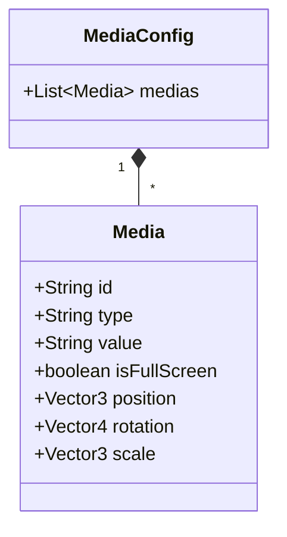

# Diagramme UML de classe des configurations de médias

Ce diagramme représente la structure des fichiers de configuration des médias

```mermaid
classDiagram
    direction TB
    
    class MediaConfig {
        +List~Media~ medias
    }
    
    class Media {
        +String id
        +String type
        +String value
        +boolean isFullScreen
        +Vector3 position
        +Vector4 rotation 
        +Vector3 scale 
    }

    %% Relations
    MediaConfig "1" *-- "*" Media
```
