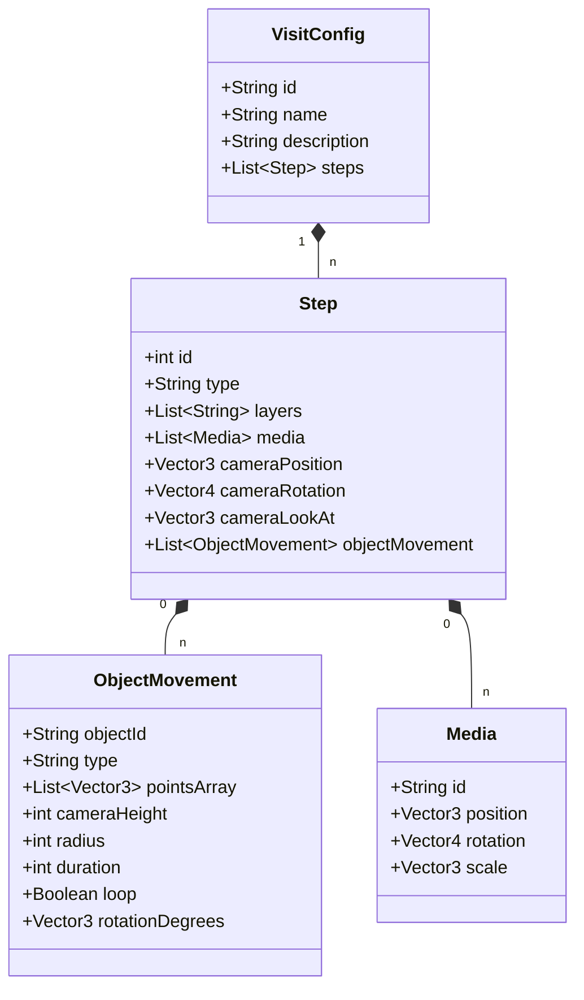

# Configuration de visite la plus complète

Ce diagramme représente la structure des fichiers de configuration des démos/visites

```mermaid
classDiagram

    class VisitConfig {
        +String id
        +String name
        +String description
        +List~Step~ steps
    }
    %%Un Visitconfig peut avoir entre 1 et n Step

    %%Entité faible de VisitConfig
    class Step {
        +int id
        +String type
        +List~String~ layers
        +List~Media~ media
        +Vector3 cameraPosition
        +Vector4 cameraRotation
        +Vector3 cameraLookAt
        +List~ObjectMovement~ objectMovement
    }
    %% Step peut avoir entre 0 et m ObjectMovement (où m est la longueur + 1 de media)

    %%ObjectMovement est une entité faible de Step
    class ObjectMovement {
        +String objectId
        +String type
        +List~Vector3~ pointsArray
        +int cameraHeight
        +int radius
        +int duration
        +Boolean loop
        +Vector3 rotationDegrees
    }

    class Media {
        +String id
        +Vector3 position
        +Vector4 rotation
        +Vector3 scale
    }

    %%Relations
    VisitConfig "1" *-- "n" Step
    Step "0" *-- "n" ObjectMovement
    Step "0" *-- "n" Media
```
